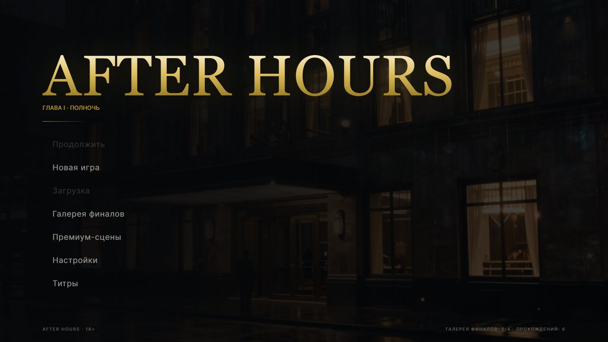
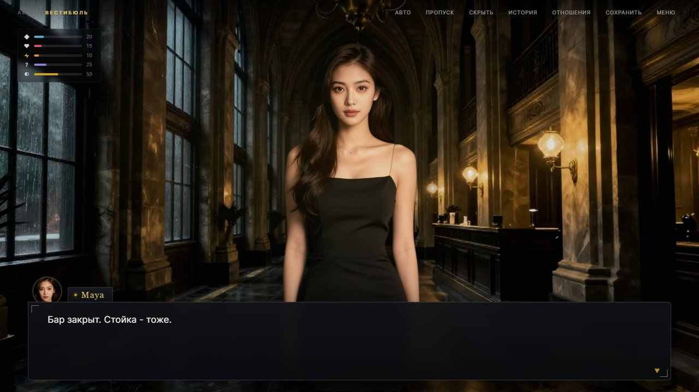
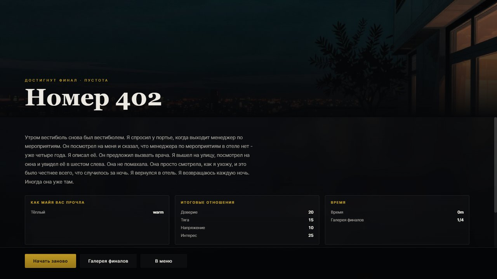
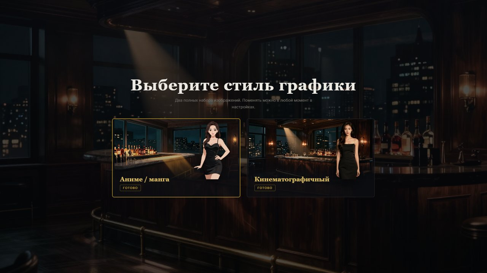
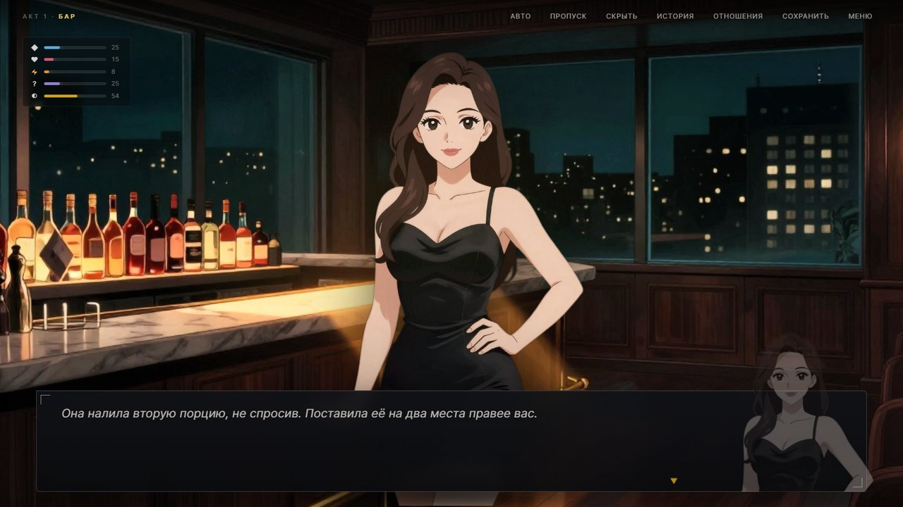
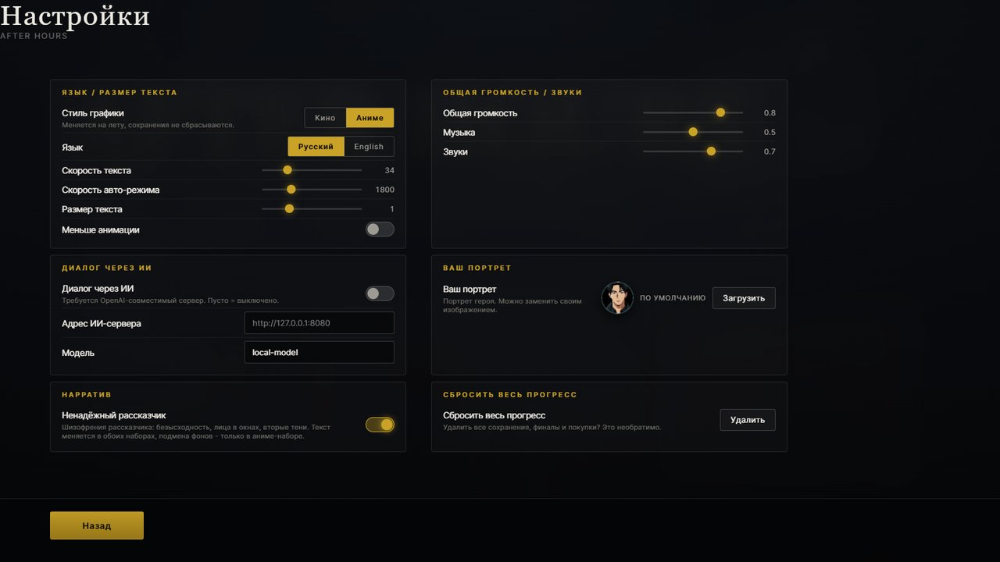

# AFTER HOURS - Глава I: Полночь

Визуальная новелла (18+). Один вечер, один отель, одна женщина, которую главный герой,
кажется, уже встречал. И коридор, в котором номер 402 стоит между 408 и 410.

Демо-версия: первая глава целиком, четыре финала, два набора графики на выбор,
русский и английский язык интерфейса.

**Играть онлайн: <https://dvodev.space/games/ah_game/>**



---

## Сюжет

Гранд-Меридиан, 00:47. Бар закрыт, стойка тоже, лифт выше третьего не идёт. За баром
стоит Майя и вытирает бокал, который уже сухой. Она менеджер по мероприятиям, и она
ждёт кого-то, кто не пришёл.

Ночь длится до рассвета. За это время можно узнать, что на брони стоит чужое имя, что
камеры на четвёртом этаже выключают в пять, и что Майя не первый год носит с собой
фотографию, снятую с платья без карманов.

Развязка зависит от того, как вы разговаривали и что выбрали: **четыре финала**, от
«остаться» до «уйти и вернуться» - и один из них вы не забудете.





---

## Что внутри

- **Два полных набора графики.** Кинематографичный (полуреалистичная живопись) и
  аниме/манга (целл-шейдинг). Это не фильтр поверх одного арта - нарисованы два
  отдельных комплекта, с одинаковыми именами файлов, и переключение мгновенное.
- **Реплики героя зависят от манеры разговора.** Четыре «персоны» (теплый, резкий,
  прямой, закрытый) меняют не только реплики Майи, но и то, как герой подаёт себя.
- **Вставки от лица игрока.** В ключевых сценах герой действует сам, и действие зависит
  от выбранной манеры.
- **Второй режим чтения.** Тумблер «Ненадёжный рассказчик» включает вторую редакцию
  текста: тот же сюжет, но рассказчик психотичен. Часть фонов в аниме-наборе
  подменяется на альтернативные.
- **Настройки**: скорость текста, размер шрифта, громкость, язык, свой портрет героя
  (можно загрузить свое изображение), переключение стиля графики на лету.
- **Сохранения, автосейв, галерея финалов, история диалога, режимы авто и пропуска.**
- **Каркас монетизации**: две премиум-сцены и экран их разблокировки. Платежей нет.



---

## Запуск

### Онлайн

Открыть <https://dvodev.space/games/ah_game/>. Ничего устанавливать не нужно.

### Локально

Игра - это статические файлы. Достаточно открыть `index.html` в браузере.

Если браузер ограничивает работу с локальными файлами, поднимите любой статический
сервер из папки с игрой:

```
python -m http.server 8080
```

и откройте <http://localhost:8080>.

Требуется современный браузер (Chrome, Edge, Firefox, Safari). Прогресс хранится в
`localStorage` браузера.

---

## Управление

| Действие | Как |
|---|---|
| Продолжить / пропустить печать | клик по экрану, `Space` или `Enter` |
| Меню | `Esc` |
| История диалога | кнопка `ИСТОРИЯ` |
| Отношения | кнопка `ОТНОШЕНИЯ` |
| Авто / пропуск | кнопки `АВТО` / `ПРОПУСК` |
| Скрыть интерфейс | кнопка `СКРЫТЬ` |



---

## Как это сделано

Чистый JavaScript без фреймворков и сборки, работает как обычный статический сайт.
Никаких внешних зависимостей и сетевых запросов - вся логика и весь текст лежат в
файлах рядом с игрой.

```
index.html            точка входа
src/css/vn.css        визуальная система: слои, анимации, адаптив
src/js/
  util.js             локализация, аналитика, резолвер изображений
  core.js             статы, персона, флаги, резолвер настроения, финалы
  save.js             слоты сохранений, автосейв, мета-прогресс
  ai.js               клиент OpenAI-совместимого сервера (опционально)
  engine.js           интерпретатор графа сцен
  ui.js               DOM: сцена, диалог, печатная машинка, интерфейс
  screens.js          меню, настройки, сохранения, галерея, премиум
  main.js             сборка приложения
src/data/
  story.json          вся нарративная логика: сцены, ветвления, финалы
  strings.json        локализация интерфейса
  ai_character.json   профиль персонажа и шаблон системного промпта
  *.js                те же данные в виде, который грузит браузер
assets/
  images/             кинематографичный набор
  images_anime/       аниме-набор (включая unreliable/ - вариант для второго режима)
```

Весь текст, ветвления и финалы описаны данными, а не кодом: сцены, реплики и условия
лежат в `story.json`, движок их только исполняет. Добавить сцену или финал можно, не
трогая JavaScript.

Персонажи и фоны сгенерированы локально (Stable Diffusion, Z-Image-Turbo), спрайты
вырезаны по альфе без прямоугольника фона.



---

## 18+

Игра содержит взрослые темы и откровенные сцены. Персонажи вымышлены, события
вымышлены.
